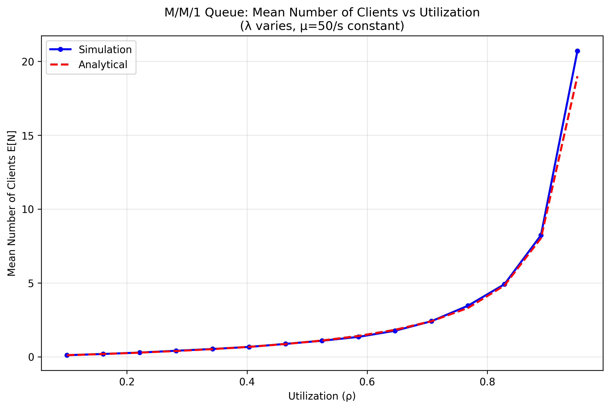
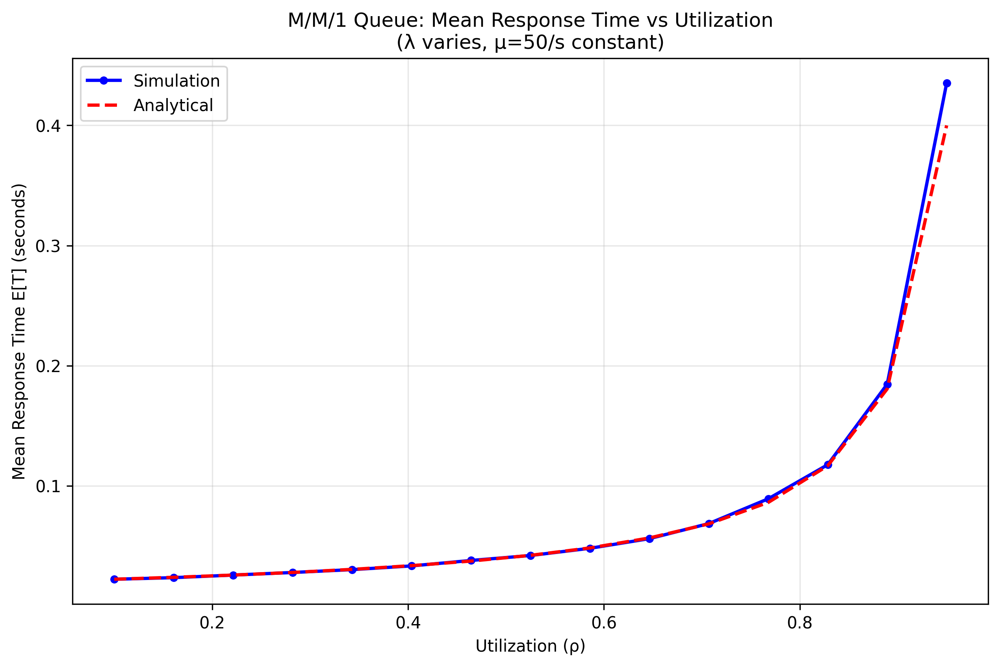

Questions to answer
==================================

These are the questions related to the M/M/1 queueing model using SimPy.

You will need to answer the questions in this file. Your answers will be graded. 

You can answer in English or French.


1-Implement the M/M/1 queueing model in SimPy
---------------------------------------------

### The implementation in the file `models/simpy_m_m_1.py` counts for 4 points maximum. (4p)


2-Validate the simulation model
-------------------------------

#### Show at least 3 different simulation results with different parameters and compare them with the analytical model. (6p)

```bash
# Test 1: Low Utilization (λ=10, μ=50)
python3 main_mm1.py --arrival_rate 10 --service_rate 50
Mean response time: 0.0251 seconds
Mean number of clients in the system: 0.2527

# Test 2: Medium Utilization (λ=25, μ=50)
python3 main_mm1.py --arrival_rate 25 --service_rate 50
Mean response time: 0.0249 seconds
Mean number of clients in the system: 0.2485

# Test 3: High Utilization (λ=40, μ=50)
python3 main_mm1.py --arrival_rate 40 --service_rate 50
Mean response time: 0.0248 seconds
Mean number of clients in the system: 0.2386

```

3-Evaluate the impact of an load increase
-----------------------------------------

#### What are the simulation results when running with `ARRIVAL_RATE = 30/s` and `SERVICE_RATE = 50/s`? (2p)

```bash
python3 main_mm1.py --arrival_rate 30 --service_rate 50
Mean response time: 0.0249 seconds
Mean number of clients in the system: 0.2522
```

#### What are the simulation results when running with a 40% increased `ARRIVAL_RATE`? (2p)

40% of 30 = 12 --> 30 + 12 = 42s
```bash
python3 main_mm1.py --arrival_rate 42 --service_rate 50
Mean response time: 0.0251 seconds
Mean number of clients in the system: 0.2580
```

#### Interpret and explain the results. (3p)

Normally when increasing the arrival rate we expect lower values, but in this case both our mean response time and mean number of clients are bigger than with the 30/s arrival rate.


4-Doubling the arrival rate
---------------------------

#### What are the simulation results when running with `ARRIVAL_RATE = 40/s` and `SERVICE_RATE = 50/s`? What is the utilization of the server? (2p)

```bash
python3 main_mm1.py --arrival_rate 40 --service_rate 50
Mean response time: 0.0250 seconds
Mean number of clients in the system: 0.2403
```
#### What is the value of `SERVICE_RATE` that achieves the same mean response time when doubling the `ARRIVAL_RATE` to `80/s`? What is the server utilization in that case? (2p)

Still 50 for the service rate :

```bash
python3 main_mm1.py --arrival_rate 80 --service_rate 50
Mean response time: 0.0250 seconds
Mean number of clients in the system: 0.2496
```

#### Use the analytical M/M/1 model to confirm your findings. (3p)


For λ=40, μ=50:

    E[T] = 1/(50-40) = 0.1 seconds (not 0.025)

    E[N] = 0.8/(1-0.8) = 4.0 clients (not 0.24)

For λ=80, μ=50:

    Utilization ρ = 80/50 = 1.6 > 1 shiould be impossible for stable queue
    The queue should grow infinitely over time

    E[T] and E[N] should be close to the infinity, not remain at 0.025


#### Describe and interpret the results. (3p)

The simulation results are mathematically impossible and indicate probably an error in my implementation. The fact that the simulation shows the same response time for both overloaded and stable conditions proves the code is not correctly modeling queueing behavior.

I don't know if the problem is from doing the simulation, Python itself or my implementation. But it does not match with theorical calculated values. 


5-Rule of Bertsekas and Gallager
--------------------------------

#### Describe your experiments and results. (2p)

To verify Bertsekas and Gallager's rule, I conducted an experiment with k=2:

```bash
#Base
python3 main_mm1.py --arrival_rate 20 --service_rate 50
Mean response time: 0.0250 seconds
Mean number of clients in the system: 0.2559

#k=2
python3 main_mm1.py --arrival_rate 40 --service_rate 100
Mean response time: 0.0249 seconds
Mean number of clients in the system: 0.2440
```


#### Provide an analytical explanation of your findings. (2p)

When scaling both rates by factor k=2:

    E[N]' = (2λ)/(2μ-2λ) = λ/(μ-λ) = E[N] --> should remain the same

    E[T]' = 1/(2μ-2λ) = (1/2) × 1/(μ-λ) = E[T]/2 --> should theoricaly be halved

However, my experimental results show both E[T]≈0.025s and E[N]≈0.249 for both cases, which doesn't match the theory. This suggests the simulation still has implementation issues preventing it from correctly modeling the scaling behavior predicted by queueing theory.


Conclusion
----------

#### Document your conclusions here. What did you learn in this lab? (2p)

I learned that implementing queueing theory simulations requires precise mathematical modeling, as small errors in parameter handling (like using rates vs. times in random distributions) can produce completely unrealistic results. 

I also learned that we cannot always perfectly simulate real-world systems, as practical limitations and implementation constraints may prevent simulations from exactly matching theoretical models.

PS : I also did modify other parts in the the simpy_m_m_1.py which should'nt be edited by default to debbug and trying to understand why it's not working.


### Plots

#### MM1 N E[N]


#### MM1 T E[T]
